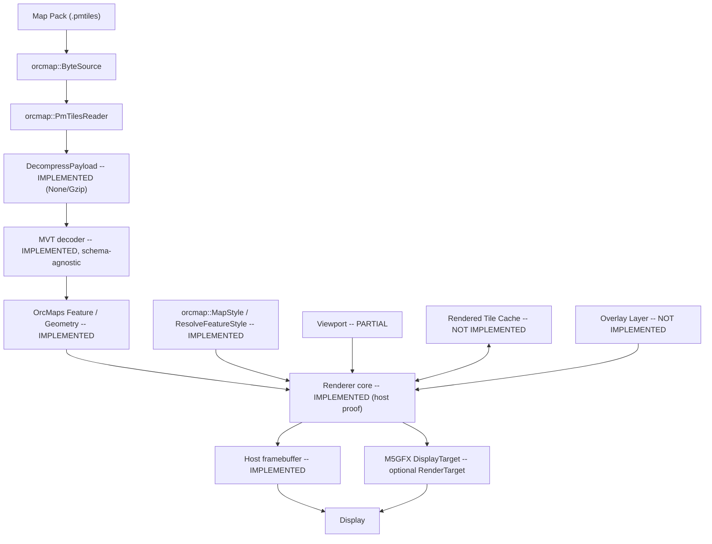

# OrcMaps Architecture

How the system actually works, as of 2026-09-13. Where a component is
described but not yet implemented, this document says so explicitly rather
than describing aspirational behavior as real — see `PROJECT_TRUTH.md`
"Document authority" and `STATUS.md` for the authoritative implementation-
state summary.

## System overview



Implemented today: `Pack -> Source -> Reader` (host-tested), bounded
`DecompressPayload` for kNone/kGzip (host-tested), schema-agnostic
`MVT decode` (host-tested), MVT → OrcMaps `FeatureTile` translation
(host-tested), `Style` (host-tested), a PARTIAL Viewport, a generic
`RenderTarget` + renderer core, a host framebuffer proof, and an optional
M5GFX `DisplayTarget` (no MVT types, no map semantics). FeatureKind
mapping is EXPERIMENTAL, not the tile-content schema.

## Major components

| Component | Path | Status |
|---|---|---|
| `orcmap::ByteSource` | `include/orcmap/byte_source.hpp` | Implemented |
| `orcmap::host::FileByteSource` | `adapters/host/file_byte_source.{hpp,cpp}` | Implemented (host only) |
| ESP-IDF `ByteSource` adapter | `adapters/esp_idf/` | Not implemented (empty dir) |
| Geo/tile math | `include/orcmap/geo.hpp`, `src/core/geo.cpp` | Implemented |
| `orcmap::PmTilesReader` | `include/orcmap/pmtiles.hpp`, `src/tiles/pmtiles_reader.cpp` | Implemented (container layer only; GetTile returns stored bytes) |
| Payload decompression | `include/orcmap/compression.hpp`, `src/tiles/compression.cpp` | Implemented (kNone/kGzip bounded; Brotli/zstd fail) |
| Vector tile (MVT) decoder | `include/orcmap/mvt.hpp`, `src/tiles/mvt_decoder.cpp` | Implemented (schema-agnostic container decode only) |
| `FeatureKind` | `include/orcmap/feature_kind.hpp` | Implemented (shared by Feature and Style; Feature does not include style.hpp) |
| OrcMaps Feature / Geometry | `include/orcmap/feature.hpp` | Implemented (format-independent; tile-local integer coords; storage layout provisional) |
| MVT → Feature translation | `include/orcmap/mvt_translate.hpp`, `src/tiles/mvt_translate.cpp` | Implemented (deep copy; does not assign FeatureKind) |
| Experimental FeatureKind heuristic | `include/orcmap/experimental/mvt_classify.hpp`, `src/tiles/mvt_classify_experimental.cpp` | EXPERIMENTAL (not the tile-content schema; not stable API) |
| `orcmap::MapStyle` / style system | `include/orcmap/style.hpp`, `include/orcmap/color.hpp`, `include/orcmap/cache_key.hpp`, `src/render/style.cpp` | Implemented |
| Viewport | `include/orcmap/viewport.hpp`, `src/core/viewport.cpp` | PARTIAL (prepared `TileScreenMap`; no overzoom, no visible-tile enumerator, no antimeridian wrap) |
| `RenderTarget` | `include/orcmap/render_target.hpp` | Implemented (immediate primitives; no command buffer) |
| Renderer core | `include/orcmap/renderer.hpp`, `src/render/renderer.cpp`, `src/render/clip.cpp` | Implemented (host-proof: ClearMapBackground + per-tile RenderFeatureTile). Not a complete map engine. |
| Host framebuffer | `adapters/host/framebuffer_target.{hpp,cpp}` | Implemented (host only; RGBA8 + optional PPM) |
| M5GFX adapter | `adapters/m5gfx/include/orcmap/m5gfx/` | Implemented as `DisplayTarget`. Exported include path; no M5GFX link in core. |
| Overlay primitives | `src/overlays/` | Not implemented (empty dir) |
| Tile/rendered-tile cache | `src/cache/` | Not implemented (empty dir); `RenderedTileCacheKey` shape exists in `include/orcmap/cache_key.hpp` |
| Pack builder | `tools/pack-builder/` | PARTIAL: Springfield/97477 host pack script (Planetiler, not a runtime dep) |
| Pack inspector | `tools/pack-inspect/` | Implemented (host). Preview visible-tile walk is scaffolding, not Viewport API. |
| Pack verifier | `tools/pack-verify/` | Not implemented (empty dir) |
| Generic ESP32 example | `examples/generic-esp32/` | PARTIAL: ESP-IDF compile/link smoke test of the portable core (no graphics framework) |
| M5GFX example | `examples/m5gfx/` | PARTIAL: ESP-IDF compile proof of DisplayTarget + synthetic FeatureTile (M5GFX, no M5Unified) |
| Host render preview | `examples/host-render/` | PARTIAL: synthetic 1280x720 PPM |
| Springfield host preview | `tools/pack-inspect/` | HOST-ONLY MEASURED: real OSM → gzip PMTiles → 1280×720. Pack/PPM gitignored under data/local. |
| Tab5 example | `examples/m5stack-tab5/` | Not implemented (empty dir) |
| Host tests | `tests/host/` | Implemented, 100% passing |
| Test fixture | `tests/fixtures/tiny.pmtiles`, `tiny.mvt`, `tiny-gzip.pmtiles` | Implemented (synthetic; gzip tile fixture for the decompress→pixels path) |
| Runtime attribution API | `include/orcmap/attribution.hpp`, `include/orcmap/map_source.hpp` | Implemented (header-only; no `MapEngine`/discovery populates it yet) |
| Consumer build gate | `tests/consumer/` | Implemented, passing |
| Data provenance registry | `data/sources/*.json` | Implemented, 9 records (4 `CONFIRMED`: Natural Earth, OpenStreetMap, geoBoundaries gbOpen, Google Open Buildings; 5 `REVIEW_REQUIRED` -- see `docs/DATA_PROVENANCE_REGISTRY.md`) |
| Pack manifest schema | `docs/PACK_MANIFEST_SCHEMA.md` | Documented, not implemented (no pack builder exists) |

## Repository layout

```
include/orcmap/      Public headers: byte_source.hpp, geo.hpp, pmtiles.hpp,
                      color.hpp, feature_kind.hpp, style.hpp, cache_key.hpp,
                      attribution.hpp, map_source.hpp, mvt.hpp,
                      compression.hpp, feature.hpp,
                      mvt_translate.hpp, viewport.hpp, render_target.hpp,
                      renderer.hpp, clip.hpp
include/orcmap/experimental/  EXPERIMENTAL FeatureKind heuristic
                      (mvt_classify.hpp) -- not stable API
src/core/             geo.cpp (Web Mercator tile math), viewport.cpp
src/tiles/            pmtiles_reader.cpp (PMTiles v3 container reader),
                      mvt_decoder.cpp (schema-agnostic MVT geometry decoder),
                      mvt_translate.cpp (MVT → FeatureTile),
                      compression.cpp (bounded None/Gzip),
                      mvt_classify_experimental.cpp (EXPERIMENTAL)
src/render/           style.cpp, renderer.cpp, clip.cpp
src/storage/          Empty -- reserved for any storage-layer logic beyond
                      the ByteSource interface itself (interface lives in
                      include/, not here).
src/overlays/         Empty -- marker/polyline/polygon primitives, planned.
src/cache/            Empty -- bounded LRU tile cache, planned.
adapters/host/        file_byte_source.{hpp,cpp} -- stdio ByteSource;
                      framebuffer_target.{hpp,cpp} -- host RGBA8 RenderTarget.
adapters/m5gfx/include/orcmap/m5gfx/  Exported optional headers
                      (`#include "orcmap/m5gfx/display_target.hpp"`).
                      Not compiled into core. Consumer supplies M5GFX.
adapters/esp_idf/     Empty -- ESP-IDF filesystem ByteSource, planned.
tools/pack-builder/   Springfield pack script (Planetiler). Not runtime.
tools/pack-inspect/   Host inspect + real-geography preview.
tools/pack-verify/    Empty -- validate a pack against its manifest, planned.
examples/generic-esp32/  ESP-IDF compile/link smoke test of the portable
                      core. No M5GFX/M5Unified. Not a map demo.
examples/m5gfx/          ESP-IDF + M5GFX compile proof (DisplayTarget).
examples/host-render/    Host PPM preview (synthetic tiles).
examples/m5stack-tab5/   Empty -- Tab5 board example, planned.
tests/host/           Host-buildable unit tests (no ESP-IDF needed).
tests/consumer/       External-consumer build gate -- public headers only,
                      see "Consumer integration test" below.
tests/fixtures/       Committed test fixtures + the script that builds them.
third_party/miniz/    Vendored miniz 3.1.2 full snapshot; only inflate compiled.
data/sources/         Data provenance registry: one JSON record per
                      reviewed map-data source, see "Data provenance and
                      attribution" below.
docs/                 Architecture/decision/porting/licensing documents.
```

## Data flow (as implemented)

1. A caller constructs a `ByteSource` over a `.pmtiles` file (today:
   `orcmap::host::FileByteSource` on the host; on-device this will be an
   `adapters/esp_idf` implementation wrapping OrcSDR's
   `orcsdr::storage::FileSystem` or raw ESP-IDF VFS — not yet written).
2. `orcmap::PmTilesReader reader(&source); reader.Open();` parses the
   127-byte header and reads+decompresses the root directory (≤16,257
   bytes compressed per spec) into `root_dir_`. Nothing else is loaded.
3. `reader.GetTile(z, x, y, &out)` computes the tile's Hilbert `tile_id`
   (`orcmap::ZxyToTileId`), binary-searches the root directory, follows at
   most one leaf-directory indirection if the archive's directory didn't
   fit in the root alone, and reads the tile's bytes directly from the
   archive at the resolved offset/length. Returns `false` (not an error)
   for a sparse/missing tile.
4. **Implemented:** `GetTile()` returns bytes **as stored**.
   `DecompressPayload()` (`include/orcmap/compression.hpp`) inflates
   kNone/kGzip with a caller `max_output_size` bound. kBrotli/kZstd fail.
   Directories and metadata use the same helper. Then `DecodeMvtTile()`.
5. **Implemented:** `TranslateMvtToFeatureTile()` copies decoded MVT into
   an owned `FeatureTile` (geometry, properties, layer name, extent).
   `FeatureKind` is not assigned here.
6. **EXPERIMENTAL:** `orcmap::experimental::AssignFeatureKinds()` may
   attach a `FeatureKind` using a layer-name heuristic. Not the schema
   decision.
7. **Implemented (host proof):** `ClearMapBackground` once per frame,
   then `RenderFeatureTile` per source tile → `RenderTarget` (host
   framebuffer). Viewport is PARTIAL. M5GFX DisplayTarget consumes this
   seam.
8. **Not yet implemented:** overzoom, antimeridian wrap, visible-tile
   enumeration, polygon holes, line width, tile cache, pack discovery,
   Brotli/zstd tile compression, OrcSDR integration.

## Map pack / archive layer

`docs/PACK_FORMAT.md` is the pack-specific reference; the byte format
itself is specified by PMTiles v3
(`github.com/protomaps/PMTiles/blob/main/spec/v3/spec.md`), not re-
described here. `PmTilesReader` implements: 127-byte header parse, unsigned
LEB128 varint decoding, delta-decoded/columnar directory entry parsing
(tile_id delta array, run_length array, length array, offset array with
the spec's "0 means contiguous with previous entry" convention), gzip
inflate via `DecompressPayload()` (`include/orcmap/compression.hpp` —
PMTiles uses full RFC 1952 gzip framing, not bare zlib/deflate; output is
bounded by a caller `max_output_size`, never `tinfl_decompress_mem_to_heap`),
and the standard integer Hilbert curve `xy2d` algorithm stacked per zoom
level (`HilbertXyToIndex`/`TilesBeforeLevel`/`ZxyToTileId`). Root/leaf
directories and metadata use the same helper. `GetTile()` still returns
archive bytes as stored.

Corruption handling implemented and tested: bad magic, unsupported version,
oversized root directory (>16,384 bytes), truncated reads, and a bounded
leaf-directory hop count (8) to reject cyclic/corrupt archives — all
covered by `tests/host/test_pmtiles.cpp`.

## Byte source / storage layer

See `PROJECT_TRUTH.md` "Storage Model". Three methods, no more:
`Read(offset, dest, length) -> size_t`, `Size() -> uint64_t`,
`Valid() -> bool`. `PmTilesReader` holds a raw, non-owning `ByteSource*` —
the caller controls the source's lifetime, matching
`orcsdr_storage::File`'s existing seek+read shape closely enough that an
ESP-IDF adapter should be a thin wrapper, not a rewrite (see
`docs/ORCMAP1_AUDIT.md` §7).

## Tile lookup

Bounded by construction: at most one root-directory binary search, at most
one leaf-directory fetch+decompress+binary-search (spec allows nesting;
`GetTile()` bounds this to 8 hops to reject corrupt/cyclic input rather
than looping), and one tile-data byte-range read. No full-archive scan, no
full-archive load, regardless of archive size — this is what makes a
50-100+ GB world archive architecturally the same code path as the 519-byte
test fixture.

## Vector tile decode

Implemented: `orcmap::DecodeMvtTile()` (`include/orcmap/mvt.hpp`,
`src/tiles/mvt_decoder.cpp`) decodes raw MVT bytes (after the caller has
run `DecompressPayload()` on `GetTile()` output when the archive stored
compressed tiles) into
`MvtTile` -> `MvtLayer[]` -> `MvtFeature[]`, each feature carrying its
geometry (as rings of tile-local `MvtPoint{x,y}`, one ring per
`MoveTo`/polygon-ring), geometry type (point/linestring/polygon), and
attributes (parallel `attribute_keys`/`attribute_values` arrays, values as
an `std::variant<monostate, string, double, int64_t, uint64_t, bool>`).

Implemented as a minimal, hand-rolled protobuf-wire-format reader scoped
to exactly the four MVT message shapes (Tile/Layer/Feature/Value) — not a
general-purpose protobuf parser, and not a dependency on any existing MVT
library. See `docs/DEPENDENCY_LEDGER.md` "Resolved: MVT decoding" for why.
Geometry command decoding (MoveTo/LineTo/ClosePath, zigzag-delta-encoded
coordinates) follows the public MVT spec directly.

**Deliberately schema-agnostic**: this decoder has no opinion about what a
layer named `"road"` or an attribute named `"class"` means — it decodes
exactly what's encoded, nothing more. Turning those bytes into OrcMaps
`Feature`s is `TranslateMvtToFeatureTile()`. Assigning `FeatureKind` is
still EXPERIMENTAL / deferred — see `docs/FORMAT_DECISION.md` "Deferred:
tile content schema".

Host-tested (`tests/host/test_mvt.cpp`) against `tests/fixtures/tiny.mvt`,
a fixture built with the widely-used `mapbox-vector-tile` reference
encoder (see `tests/fixtures/generate_mvt_fixture.py`), covering all three
geometry types, all four attribute value representations actually
exercised (string/double/int64/bool), and corruption handling (empty
buffer, garbage bytes, truncated tile).

## Feature / geometry model

Implemented: `include/orcmap/feature.hpp`. OrcMaps-owned types:

- `Point` — tile-local `int32_t` x/y
- `Path` — `std::vector<Point>` (linestring or one polygon ring)
- `Geometry` — `GeomType` + list of paths
- `Feature` — id, geom type, optional `FeatureKind`, layer name, extent,
  geometry, parallel property key/value arrays
- `FeatureTile` — owned list of `Feature`

`GeomType` (shape) is not `FeatureKind` (semantic class). A polygon is not
automatically water or a building. `kind_assigned` is false until a
classifier runs.

`TranslateMvtToFeatureTile()` (`src/tiles/mvt_translate.cpp`) is the
format boundary: it deep-copies MVT into FeatureTile so the `MvtTile` can
be destroyed. It does not assign `FeatureKind`.

`orcmap::experimental::AssignFeatureKinds()` is a replaceable layer-name
heuristic for tests. It is not the production schema.

`GeomType` lives only on `Geometry` (`feature.geometry.type`). Feature
storage (per-feature layer string + extent) is provisional.

## Renderer

**IMPLEMENTED** for a host proof, not a complete map engine.
`ClearMapBackground()` fills the target once per frame via
`ResolveFeatureStyle(kBackground)`. `RenderFeatureTile()` then draws one
source tile **without** clearing. Returns false on null target, invalid
zoom, or `source_tile.z != viewport.zoom` (overzoom is not guessed).
Unclassified features (`kind_assigned == false`) are skipped. Polygon fill
uses the **first path only** as a simple outer ring; additional paths
(holes) are not subtracted — locked by `tests/host/test_render.cpp`.
Strokes are 1px (`width_px` not rasterized).

Projection uses `TileScreenMap` (`MakeTileScreenMap` once per source tile /
extent, then `ProjectLocal` multiply-add per vertex). Mercator center math
does not run per vertex. Screen coords saturate to `int` range. Line
rasterization clips with Liang-Barsky (`ClipLineToPixels`) before
Bresenham. Polygon scanline intercepts use `int64_t`.

`RenderTarget` (`include/orcmap/render_target.hpp`) is an immediate
interface: `FillRect`, `DrawPoint`, `DrawLine`, `FillPolygon`. No command
buffer. Color is `orcmap::Color` (RGBA8).

`Viewport` (`include/orcmap/viewport.hpp`) is **PARTIAL**: center lat/lon,
zoom, output size, `tile_size_px`, and a prepared `TileScreenMap`. No
visible-tile enumerator, no overzoom, no antimeridian wrap
(`tile.x - center.x` is a raw subtract). Zoom is 0..31.

`orcmap::host::FramebufferTarget` is the first target (RGBA8 buffer, optional
P6 PPM). It is host-only (`adapters/host/`), not part of the ESP-IDF
component.

`adapters/m5gfx/DisplayTarget` implements `RenderTarget` on
`lgfx::v1::LovyanGFX&` (RGB565 via `ToRgb565`, lines clipped with
`ClipLineToPixels`). It has no MVT types and no map semantics. If
`adapters/m5gfx/` were deleted, core must still build and host-test.

## Projection / coordinates

`include/orcmap/geo.hpp` / `src/core/geo.cpp`. Standard Web Mercator tile
math: `LatLonToTileCoord`/`LatLonToTile`/`TileToLatLon`/`TilesPerAxis`,
with `WrapLongitudeDeg` (antimeridian) and `ClampLatitudeDeg` (Mercator's
±85.05112878° limit) applied internally so the functions are always
well-defined for any finite input — no NaN/Inf, no unsigned-integer
underflow at the poles or antimeridian (a real bug of this kind was caught
by `tests/host/test_geo.cpp` and fixed during this work: clamping must
happen in floating point *before* casting to `uint32_t`, not after). RF
distance/bearing/geodesic math is explicitly out of scope here — that
stays in OrcSDR.


## Style system

Fully implemented — see `docs/STYLING.md` for the complete design (this is
the canonical reference; not duplicated here). Summary: `MapStyle` +
`FeatureRule` (15 categories × color/width/zoom-visibility) +
`ResolveFeatureStyle()` + `StyleManager` (runtime switching) +
`RenderedTileCacheKey` (style-aware cache invalidation). Four built-in
styles in `src/render/style.cpp`. Host-tested in
`tests/host/test_style.cpp`.

## Data provenance and attribution

Two related but distinct pieces, both implemented today:

- **Build-time / review-time provenance**: `data/sources/*.json`, one
  record per reviewed map-data source (`docs/DATA_PROVENANCE_REGISTRY.md`
  for the schema, `docs/DATA_AND_LICENSING.md` for the policy). Validated
  by `tools/check_data_provenance.py`
  (`.github/workflows/data-provenance.yml`), the sibling to Documentation
  Truth described below. This has nothing to do with the C++ engine at
  runtime — it's what gates which datasets are even allowed into an
  official pack build.
- **Runtime attribution**: `orcmap::AttributionInfo`
  (`include/orcmap/attribution.hpp`) and `orcmap::MapSourceInfo` +
  `CollectRequiredAttribution()` (`include/orcmap/map_source.hpp`),
  host-tested in `tests/host/test_attribution.cpp`. This is what a future
  consuming application asks the *running* engine, once pack manifests
  and discovery exist to populate `MapSourceInfo` for real — the intent
  (`docs/DATA_AND_LICENSING.md` "Runtime attribution") is that an
  application never hard-codes `"(c) OpenStreetMap contributors"`; it
  calls something like `map.activeSources()` and reads each source's
  `AttributionInfo` instead. Today these two structs exist and are
  correct, but nothing populates a real `MapSourceInfo` from an actual
  opened pack yet — that wiring depends on the pack manifest
  (`docs/PACK_MANIFEST_SCHEMA.md`) and pack discovery, neither of which
  exist yet (`ROADMAP.md`).

The core engine intentionally never renders attribution text itself
(`AttributionInfo` carries `text`/`url`, not a draw call) — this mirrors
the same reasoning as the style system not rendering itself: it would
constrain the application/renderer adapter's UI flexibility. See
`docs/STYLING.md` "Renderer relationship" for the parallel case.

## Label system

Not implemented. ORCMAP1 drew labels with no collision avoidance or
priority (`docs/ORCMAP1_AUDIT.md` §4); `MapStyle::label_scale` and
`label_priority_threshold` exist as forward-looking fields in the style
struct but nothing consumes them yet, since there is no label decode/draw
path yet.

## Overlay system

Not implemented (`src/overlays/` is empty). Intended primitives: marker,
icon, text label, polyline, polygon, circle, route, track, waypoint — all
generic, all ignorant of what an application's data means. See
`PROJECT_TRUTH.md` "Map Data vs Rendering vs Overlay Separation".

## Cache architecture

Not implemented (`src/cache/` is empty). The cache **key** shape exists and
is tested (`orcmap::RenderedTileCacheKey`, `include/orcmap/cache_key.hpp`):
`pack_id_hash, z, x, y, style_id_hash, style_version, renderer_version`.
Intended two-level design per `docs/ORCMAP1_AUDIT.md`/original design
brief: a small bounded RAM/PSRAM LRU cache of currently-needed tiles, plus
an optional SD-backed cache of expensive vector-decoded renders (RGB565) —
deletable without damaging the underlying pack.

## SD storage

Not implemented on-device. See "Byte source / storage layer" above and
`docs/ORCMAP1_AUDIT.md` §7 for the existing OrcSDR storage layer this will
adapt to.

## Background work / scheduling

Not implemented. Constraint carried forward from ORCMAP1
(`docs/ORCMAP1_AUDIT.md` §2): any pack I/O must never run on a real-time
thread (SDR/USB/audio). OrcSDR's `catalog_sync` already runs its I/O on a
dedicated pinned FreeRTOS task — the intended pattern to follow, not
reinvent, once pack download/install is built for OrcMaps-scale packs.

## OrcSDR integration boundary

Not yet wired up — OrcSDR's branch still uses its own `offline_map.cpp`.
The intended boundary, once built: OrcSDR links OrcMaps as a version-pinned
ESP-IDF component (`idf_component.yml`, already present in this repo,
`version: "0.1.0"`), never includes OrcMaps' `src/` internals directly, and
implements its own `adapters/esp_idf`-shaped `ByteSource` and any
OrcSDR-specific overlay types entirely in OrcSDR's own code.

The "never includes `src/` internals" rule is not just a convention —
`tests/consumer/` (see "Consumer integration test" below) structurally
proves a consumer can build against `include/orcmap/` + `adapters/host/`
alone, the same shape OrcSDR would use with `adapters/esp_idf/` once it
exists. Pinning follows OrcSDR's existing `esp-rtl-sdr` dependency exactly
(`git:` URL + full 40-character commit SHA, not a branch or floating tag)
— see `PROJECT_TRUTH.md` "Public API and Versioning" for the actual
manifest snippet this is modeled on.

## Error handling

`PmTilesReader::Open()`/`GetTile()`/`ReadMetadata()` never throw; they
return `bool` and leave output parameters untouched or empty on failure.
Corrupt/truncated/hostile input (bad magic, oversized directory length,
cyclic leaf-directory chains) is rejected rather than causing undefined
behavior — see `tests/host/test_pmtiles.cpp`'s `TestCorruptArchive` and the
bounded-allocation guards (`kMaxRootDirBytes`, `kMaxDirectoryReadBytes`,
the 8-hop leaf-directory limit) in `pmtiles_reader.cpp`.

## Testing architecture

All current tests build and run on a plain host C++17 toolchain with no
ESP-IDF, no hardware, via `tests/host/CMakeLists.txt` (a standalone CMake
project, not a subdirectory of the ESP-IDF component build — see "Build
system" below). No test framework dependency: a ~40-line macro-based
harness (`tests/host/test_util.hpp`) is used instead, since the test
surface doesn't yet justify one. `tests/fixtures/tiny.pmtiles` (519 bytes)
is a synthetic PMTiles archive built by the *official* Protomaps Python
`pmtiles` library (BSD-3-Clause, dev-tool only — see
`tests/fixtures/generate_fixture.py`), so the reader is validated against
an independent reference implementation, not just against itself.

Current coverage: geo/tile math (wrap, clamp, known tiles, antimeridian,
high-latitude clamping, round-trip containment), PMTiles container
(header fields, metadata, known-tile byte-exact content, sparse/missing
tiles, corrupt-file handling, Hilbert ID uniqueness/monotonicity), the
style system (built-in ids, default style, runtime switching with graceful
fallback, zoom visibility, Night style's no-blue-light constraint, style
distinctness, cache-key behavior), the runtime attribution helpers
(no-sources/excluded/included/mixed/deduplicated cases), MVT decode
(all three geometry types, all four exercised attribute value
representations, corrupt/truncated/empty-buffer handling), and Feature /
MVT translation (empty tile, owned copy after `MvtTile` destruction,
fixture point/line/polygon, experimental classifier, unrecognized layer
left unassigned). All passing as of this writing — see `STATUS.md` for
how to reproduce.

## Consumer integration test

`tests/consumer/` (`CMakeLists.txt` + `consumer_smoke_test.cpp`) is a
second, separate standalone CMake project — not a subdirectory of
`tests/host/` — that builds a small executable using *only* headers under
`include/orcmap/` and `adapters/host/`, linked against the engine sources
compiled the normal way. Its own include path never adds `src/` or
`third_party/`, so a consumer-side `#include` reaching into engine
internals is a build failure, not a lint warning — see "OrcSDR integration
boundary" above and `PROJECT_TRUTH.md` "Public API and Versioning". It
exercises what's real today: tile-coordinate math, opening the fixture
archive and reading a tile, decoding MVT, translating to `FeatureTile`,
resolving a built-in style, and the runtime attribution API. Extend it as
real API surface is added; do not let it silently stop reflecting what a
real consumer would need.

## Documentation and provenance tooling

Two deterministic, stdlib-only checkers, both adapted from (or, for the
second, modeled directly on) OrcSDR's own `documentation-truth.yml`/
`check_documentation_truth.py` pattern — see `PROJECT_TRUTH.md` "Local
Development Conventions" for why both exist as project rules, not optional
tooling:

- **`tools/check_documentation_truth.py`** (tested by
  `tests/test_documentation_truth.py`, 17 unit tests, run via
  `python -m unittest discover -s tests -p 'test_documentation_truth.py'`).
  Runs in CI (`.github/workflows/documentation-truth.yml`, on every PR,
  push to `main`, and weekly). Checks: local Markdown links resolve,
  backtick-quoted repository file references resolve (excluding
  brace-expansion shorthand like `foo.{hpp,cpp}`), this file's "Major
  components" table's empty/implemented directory claims match the actual
  filesystem, documented host-test-function counts match the actual count
  of `void TestXxx(...)` definitions in `tests/host/test_*.cpp` (masking
  fenced code blocks first, so an example value in a `docs/*.md` sample
  JSON block can't be misread as a real claim), documented component
  version strings match `idf_component.yml` (same code-fence masking), an
  unqualified claim that this project lacks CI never survives alongside an
  existing workflow file, no AI-prompt residue leaks into committed docs,
  any future historical/superseded doc carries a visible marker, and the
  provenance policy documents below actually exist and `PROJECT_TRUTH.md`
  still states the IP-safety principle.
- **`tools/check_data_provenance.py`** (tested by
  `tests/test_data_provenance.py`, 20 unit tests) is the sibling checker
  for map-data licensing policy rather than documentation consistency —
  see "Data provenance and attribution" above for what it validates. It
  does not decide what a license means; it enforces decisions already
  recorded in `data/sources/*.json` against `docs/DATA_PROVENANCE_REGISTRY.md`'s
  rules (e.g. `ODBL` sources must have `share_alike_required: true`, no
  source can be `clean_pack_allowed` unless its class is public-domain-
  class, `REVIEW_REQUIRED` sources can never be `official_pack_allowed`).

## Build system

- Repo-root `CMakeLists.txt`: ESP-IDF component registration
  (`idf_component_register`), matching `hardcoreerik/esp-rtl-sdr`'s
  pattern exactly (repo root = component root). Currently registers only
  the portable-core sources that exist (`src/core/geo.cpp`,
  `src/tiles/pmtiles_reader.cpp`, `src/tiles/mvt_decoder.cpp`,
  `src/tiles/mvt_translate.cpp`,
  `src/tiles/mvt_classify_experimental.cpp`, `src/render/style.cpp`,
  vendored miniz). `REQUIRES ""` — core has no M5GFX/M5Unified/ESP-IDF
  component dependency.
- `tests/host/CMakeLists.txt`: separate, standalone CMake project (its own
  `project()` call), building `orcmap_host_tests` directly from source —
  no ESP-IDF toolchain involved. This is deliberate, again matching
  `esp-rtl-sdr`'s precedent, so host tests are always runnable in a plain
  dev environment.
- `examples/generic-esp32/`: in-tree ESP-IDF application that consumes the
  repo-root `orcmap` component. **Compile/link of the portable core has
  been proven** against ESP-IDF 6.0.2, target `esp32p4` (see STATUS.md).
  It is a smoke test, not a map demo: no file I/O, no graphics framework.
  GitHub Actions does **not** yet run this build.
- GitHub Actions today: Documentation Truth and Data Provenance Truth
  only. Host C++ tests, consumer smoke test, ESP-IDF compile, sanitizers,
  and fuzzing are **not** CI gates yet — do not claim they are.

## Dependency inventory

See `docs/DEPENDENCY_LEDGER.md` for the full, authoritative table. Summary:
miniz 3.1.2 (MIT, full source snapshot vendored under `third_party/miniz`;
only inflate is compiled) is the only runtime dependency. The official `pmtiles` Python package
(BSD-3-Clause) is a dev-only fixture-generation tool, not vendored, not
shipped.

## Performance architecture

Not yet measurable — a host renderer exists, but there is no real pack and no on-device map
draw. `examples/generic-esp32` proves the component links; it is not a
performance result. See `docs/PERFORMANCE.md` (placeholder) and
`ROADMAP.md`.

## Security / integrity

Pack-level SHA-256 verification is a documented requirement
(`docs/DATA_AND_LICENSING.md`) but not yet implemented in this repo
(OrcSDR's existing `catalog_sync.cpp` already does this for its own
packs — see `docs/ORCMAP1_AUDIT.md` §6 — and is the pattern to generalize,
not reinvent). `PmTilesReader` itself defends against malformed/hostile
archive *structure* (oversized allocations, cyclic leaf directories) but
performs no cryptographic verification of archive contents — that is a
pack-installer-layer concern, not the reader's.

Adjacent but distinct: **legal/IP integrity**, i.e. knowing a pack's
contents were legitimately sourced in the first place, is handled by the
data provenance registry (`data/sources/*.json`,
`tools/check_data_provenance.py`) and, once pack manifests exist,
`sources[].provenance_id` references validated against it
(`docs/PACK_MANIFEST_SCHEMA.md` "Future checker extension"). SHA-256
answers "is this the exact bytes we published"; the provenance registry
answers "were we allowed to publish this at all" — both matter, neither
substitutes for the other.

## Future extension points

- `adapters/esp_idf`: designed for, not yet built.
- `adapters/m5gfx`: `DisplayTarget` is a RenderTarget. Not compiled into
  core. Not the renderer architecture.
- External `.orcstyle` files: `MapStyle`'s shape doesn't block this (see
  `docs/STYLING.md`), no loader exists.
- Brotli/zstd tile compression: `DecompressPayload()` implements kNone and
  kGzip only; `kBrotli`/`kZstd`/`kUnknown` return `false` (unsupported) —
  flagged for whoever builds a pack that uses them. No extra libraries.
- HTTP Range `ByteSource`: explicitly anticipated by the `ByteSource`
  interface shape, not implemented.
